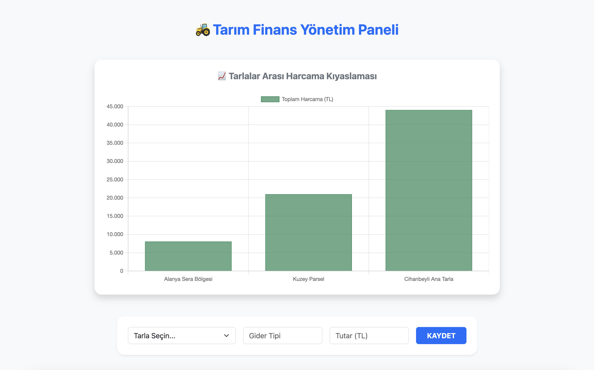

# 🚜 Tarım Finans Yönetim Paneli

Bu proje, tarımsal işletmelerin finansal süreçlerini dijitalleştirmek, harcamaları kategorize etmek ve dönüm başı maliyet analizi yaparak kârlılığı ölçmek amacıyla geliştirilmiş bir **Karar Destek Sistemi (KDS)** projesidir.

Özellikle Konya/Cihanbeyli ve Antalya/Alanya bölgelerindeki üretim alanlarının gerçek zamanlı finansal takibi için optimize edilmiştir.

## 📸 Proje Görselleri

### 📊 Finansal Analiz ve Harcama Kıyaslaması
Tarlalar arası toplam harcama dağılımı Chart.js kullanılarak görselleştirilmiştir. Bu sayede üretim merkezleri arasındaki maliyet farkları anlık olarak takip edilebilir.

### 🌾 Üretim Alanları ve Birim Maliyet Metrikleri
Sistem, her tarla için toplam harcamayı otomatik olarak hesaplar ve alan büyüklüğüne göre "Dönüm Başı Maliyet" verisini sunar.

## 🚀 Temel Özellikler
* **Çoklu Lokasyon Yönetimi:** Cihanbeyli (330 Dönüm), Alanya Sera Bölgesi (50 Dönüm) ve Kuzey Parsel (120 Dönüm) gibi farklı alanların eşzamanlı takibi.
* **Akıllı Gider Girişi:** Mazot, gübre ve tohum gibi masrafların ilgili tarlalara saniyeler içinde işlenmesi.
* **Finansal Analitik:** Verilerin SQL JOIN sorguları ile birleştirilerek toplam ve birim maliyetlerin hesaplanması.
* **Dinamik Veri Görselleştirme:** Harcamaların grafikler üzerinden kıyaslanması.

## 🛠️ Teknolojik Altyapı
* **Frontend:** React (Vite), Bootstrap (UI Kit), Chart.js (Data Vis)
* **Backend:** Node.js, Express.js
* **Veritabanı:** PostgreSQL

## 📈 Verimlilik Analizi Mantığı (MIS/YBS Odaklı)
Sistem, tarımsal kârlılığı ölçmek için aşağıdaki matematiksel modeli temel almaktadır:

$$\text{Dönüm Başı Maliyet} = \frac{\sum \text{Toplam Harcamalar}}{\text{Toplam Alan (Dönüm)}}$$

Bu analiz sayesinde Cihanbeyli'deki geniş arazilerin (Nohut/Buğday) maliyet yapısı ile Alanya'daki yüksek yoğunluklu muz seralarının verimliliği karşılaştırılabilmektedir.
